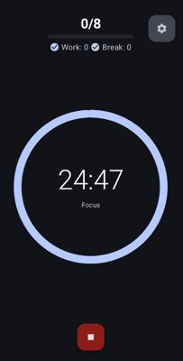

# Circle

A minimalistic Pomodoro timer for Android that actually works.

## Why Circle?

Most productivity apps overwhelm you with features you don't need. Circle does one thing well: keeps you focused with reliable 25-minute work sessions and structured breaks.

## Screenshots




## Features

- **One-tap start** - No setup required
- **Reliable timing** - Works in background without interruption  
- **Flexible intervals** - 15-90 minute **sessions**, traditional or custom
- **Progress tracking** - Simple streaks and completion charts
- **Home screen widget** - Quick controls without opening the app

## How to Install

### From GitHub Releases

1. Go to [Releases](https://github.com/smirnoffmg/circle-pomodoro-app/releases)
2. Download the latest `app-release.apk`
3. Enable "Install from unknown sources" in Android settings
4. Install the APK

### Self Build

```bash
git clone https://github.com/smirnoffmg/circle-pomodoro-app.git
cd circle-pomodoro-app
./gradlew assembleRelease
```

APK will be generated at `app/build/outputs/apk/release/app-release.apk`

**Requirements**: Android SDK 34, Java 17, Gradle 8.8+

---

*Built for focus, not features*